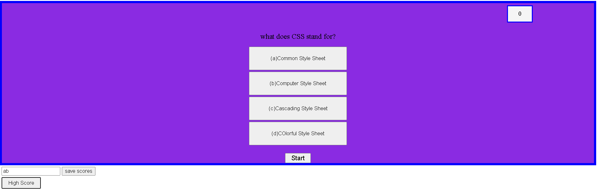
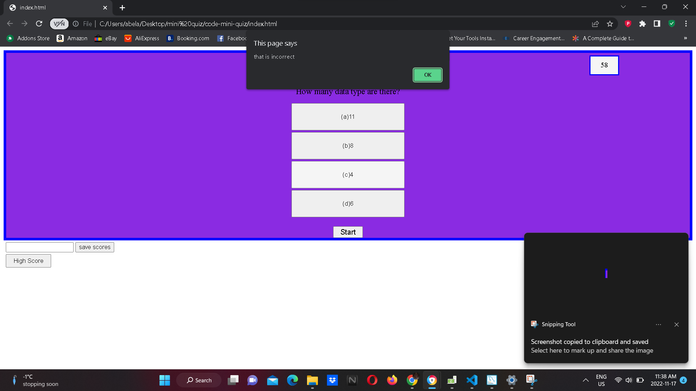

# code-mini-quiz

craeating a short mini code quiz with timer that start from 60 seconds for every question.
question is out of 4 and displays a mark out of 4 at the end

when i click start,
timer automatically starts with question in order as well with 4 multiple choice answer 
if users answer incorrectly, alert pops on and alert that answer is wrong which also subtract 5 seconds from timer 

after quiz ends , timer is displayed as mark

users can submit their score with their initials into local storage
users can also sumbit to compare to highest score with their current mark

# COde Mini Quiz

## Description

creating a mini quiz assesment for student and users about coding. 
to test users knowladge with an assesmnt in order to prepare the final assesment during interviews
we hope that it builds the cofidence for users in order to be successful for future assements 

## Installation

What are the steps required to install your project? Provide a step-by-step description of how to get the development environment running.

first i've created a start button which will start the quiz when it is clicked by creating a variable called start
i then created a timer of 60 seconds counting down evry second, i also connected the start button with th timer so when it is clicked timer has begun
created a timer id  that intiate the direct the first question when timer has begun and further continue the nex question after answering
after timer hits to 0  then quiz will end

## Usage

## Credits

List your collaborators, if any, with links to their GitHub profiles.

